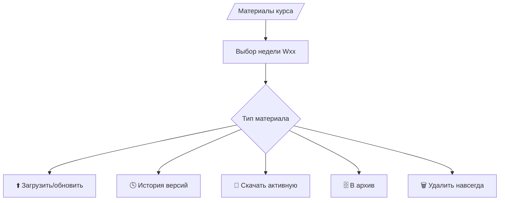
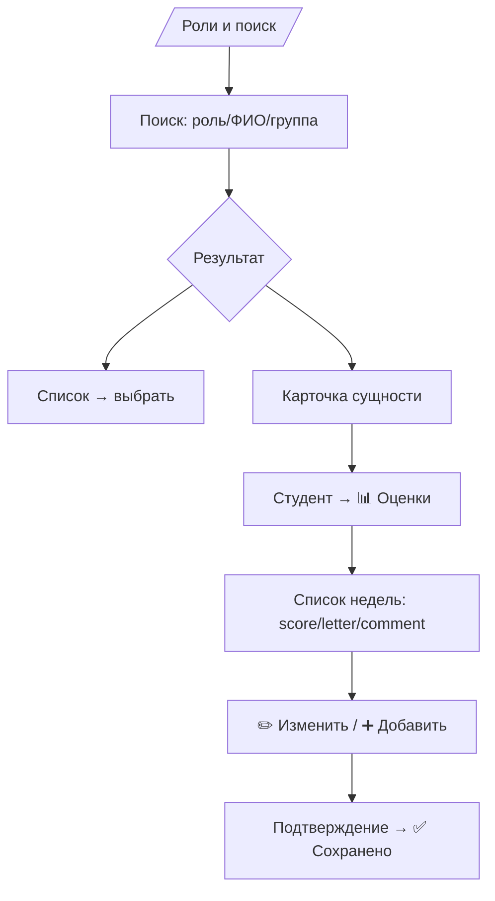
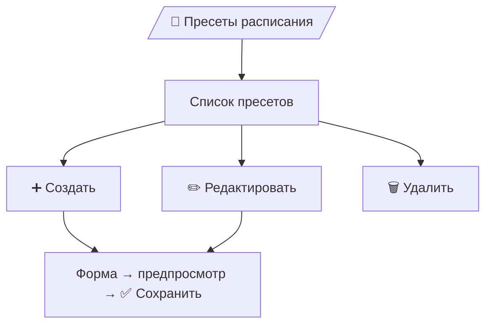

# L2 — UX-спецификация: Owner v0.8 (синхронизировано с L1 v0.8)

## Главное меню `/owner`
```
⚙️ Управление курсом
📚 Материалы курса
👨‍🏫 Роли и поиск
🧩 Пресеты расписания
📂 Архив решений
📊 Аналитика и отчёты
```
---

### ⚙️ Управление курсом
- **Инициализация**: название, описание, кол-во недель, TZ, язык → `✅ Курс инициализирован`.
- **Настройки курса**: политики (отмены/напоминания), лимиты решений (≤5, ≤30 МБ), лимиты материалов (≤100 МБ/файл), notify по изменениям слотов → `✅ Настройки обновлены`.

---

### 📚 Материалы курса
- При выборе недели появляется список типов материалов:
  - 📖 Домашние задачи и материалы для подготовки
  - 📘 Методические рекомендации (teacher-only)
  - 📝 Конспекты
  - 📊 Презентации
  - 🎥 Записи лекций (ссылка)
- Действия по каждому типу:
  - ⬆️ Загрузить/обновить файл/ссылку (новая версия становится активной)
  - 🕓 История версий (скачать любую)
  - 🗄️ Переместить в архив
  - 🗑️ Удалить навсегда (только из архива)
  - 📂 Скачать активную
- Тосты: `✅ Материал загружен`, `🗄️ Перемещено в архив`, `🗑️ Удалено навсегда`.

#### Flow (Материалы)

---

### 👨‍🏫 Роли и поиск
- **Импорт**:
  - Преподаватели: CSV/Excel (ФИО, weekly_limit) → `✅ Преподаватели загружены`.
  - Студенты: CSV/Excel (ФИО, группа, lms_email) → `✅ Студенты загружены`.
- **Поиск**: по ролям/ФИО/группе → список / карточка сущности.
- **Карточка студента**:
  - ℹ️ Профиль (ФИО, группа, lms_email)
  - 📜 История сдач
  - 📊 Оценки по неделям → **✏️ Изменить / ➕ Добавить (override)**
- **Автоназначение**: кнопка → предпросмотр матрицы «студент×неделя→преподаватель» → `✅ Автоназначение выполнено` (+ экспорт CSV/XLSX).

#### Flow (Роли/поиск и override оценок)

> При override Owner вводит: `score 1–10`, `letter A–D` (можно автоподбор из score), `comment` опционально.

---

### 🧩 Пресеты расписания (глобальные)
- Список пресетов (название, тип `online|offline`, краткое описание).
- Действия: `➕ Создать` · `✏️ Редактировать` · `🗑️ Удалить` · `👁️ Просмотр`.
- Поля пресета:
  - Название, описание
  - Тип: `online|offline`
  - Для `online`: шаблон/ссылка (опц.)
  - Для `offline`: аудитория/комплекс (опц.)
  - Набор шаблонов слотов: **день недели/дата**, время начала, длительность/время конца, вместимость
- Подтверждение и предпросмотр: список слотов, которые будет порождать пресет.

#### Flow (Owner → Пресеты)

---

### 📂 Архив решений
- Фильтры: неделя / студент / дата.
- Карточка файла: `📂 Скачать` · `🗑️ Удалить навсегда`.

---

### 📊 Аналитика и отчёты
- Виды: по студентам / по преподавателям / по неделям.
- Экспорт: CSV/XLSX.
- Показатели соответствуют L1 (Time-To-Book, Time-To-Grade и пр., вычисляются на бэкенде).

---

### Системные ограничения/правила (на уровне UX)
- Онлайн-слот: вместимость ≤3; очный: ≤50.
- Суммарное время слотов в сутки на преподавателя ≤6 часов.
- Одна активная запись студента на неделю (предлагаем «перезаписаться»).
- Все потенциально разрушительные действия — с подтверждением и тостами.
