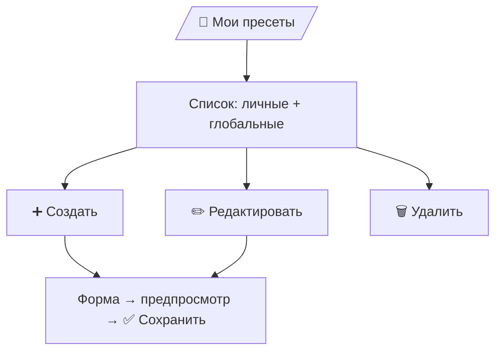
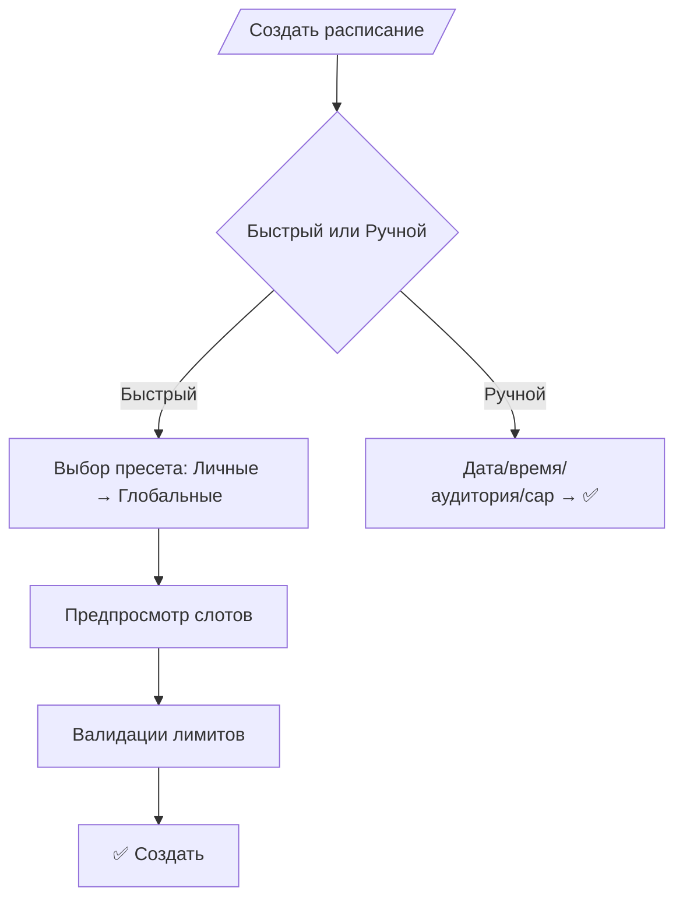

# L2 — UX-спецификация: Teacher v0.8 (синхронизировано с L1 v0.8)

## Главное меню `/professor`
```
➕ Создать расписание
📅 Управление расписанием
🧩 Мои пресеты
📚 Методические материалы
👨‍🎓 Сдачи студентов
```
---

### 🧩 Мои пресеты (личные)
- Список личных пресетов преподавателя + доступные **глобальные** (read-only).
- Действия: `➕ Создать` · `✏️ Редактировать` · `🗑️ Удалить` · `👁️ Просмотр`.
- Поля идентичны Owner-пресетам (название, описание, тип online/offline, ссылка/аудитория, шаблоны слотов).
- Подтверждение и предпросмотр перед сохранением.

#### Flow (Teacher → Пресеты)

---

### ➕ Создать расписание — мастер
1) **Выбор способа**: «Быстрый» или «Ручной».  
2) **Быстрый**: выбор пресета:  
   - сначала «Личные пресеты»,  
   - затем «Глобальные» (от Owner).  
   → предпросмотр слотов, проверка лимитов (онлайн ≤3, очно ≤50, ≤6 ч/сутки), `✅ Создать`.  
3) **Ручной**: дата/время, аудитория, вместимость.  
→ предпросмотр → `✅ Слот создан`.

#### Flow (Создание расписания)

---

### 📅 Управление расписанием
- Список слотов по датам → карточка слота:
  - `Открыть/Закрыть`
  - `Изменить`
  - `Удалить` (с уведомлениями студентам по политике курса)
  - `👨‍🎓 Студенты` (список записавшихся)

---

### 📚 Методические материалы
```
📖 Домашние задачи и материалы для подготовки
📘 Методические рекомендации (teacher-only)
📝 Конспекты
📊 Презентации
🎥 Записи лекций
⬅️ Назад
```
- Видимость: преподаватель видит **все типы материалов** (активные версии).  
- Действие: получить файл/ссылку в чат (`📂 Материал отправлен`).

---

### 👨‍🎓 Сдачи студентов
- Раздел «Ближайшие (сегодня + 2 дня)».
- Если записей >10 — **адаптивная группировка по фамилии**.
- Карточка студента по записи:
  - `📂 Скачать решения`
  - `✅ Поставить оценку` (score 1–10, letter A–D, comment).

#### Flow (Сдачи)
```mermaid
flowchart TD
  A0[/Сдачи студентов/] --> A1[Ближайшие (0–2 дня)]
  A1 --> A2{>10?}
  A2 -- да --> A3[Группировка А–Я (адаптивно)]
  A2 -- нет --> A4[Список]
  A3 --> A4
  A4 --> A5[Карточка студента]
  A5 --> A6[📂 Скачать решения]
  A5 --> A7[✅ Поставить оценку]
```
---

### Системные ограничения/правила (на уровне UX)
- Виден только **активный** набор материалов и только свои слоты.
- Оценка — 10-балльная + буква (A–D). Owner может позднее сделать override (см. L1), UI преподавателя это не меняет.
