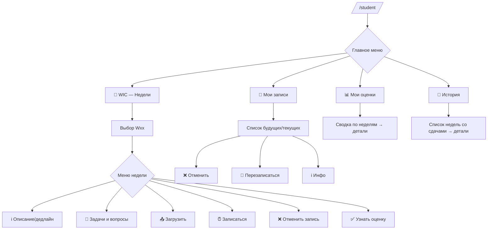

# UX‑маппинг — Студент (`/student`)

## Принципы
- Два уровня: сводные экраны + работа по неделям (WIC).
- Кнопочная навигация (Inline), минимум текста.
- Везде: **⬅️ Назад**, **🏠 В меню**.
- Анти‑дублирование записей: при существующей записи → предлагается `🔄 Перезаписаться`.

## Главное меню студента
```
📘 WIC — Работа с неделями
📅 Мои записи на сдачу
📊 Мои оценки
📜 История сдач
```

## 📘 WIC — Работа с неделями
1) Выбор недели `W01..Wnn`
2) Меню недели:
```
ℹ️ Описание и дедлайн
📝 Получить задачи и вопросы
📤 Загрузить решение
⏰ Записаться на сдачу
❌ Отменить запись на сдачу
✅ Узнать оценку
⬅️ Назад
```

## 📅 Мои записи на сдачу
- Список будущих/текущих записей с действиями:
`❌ Отменить`, `🔄 Перезаписаться`, `ℹ️ Инфо`.

## 📊 Мои оценки
- Сводка по всем неделям, клик по неделе → детали (комментарий, ссылка на работу).

## 📜 История сдач
- Прошедшие недели, по каждой: преподаватель, слот (дата/время), оценка, ссылка на работу.

## Сводные статусы студента (агрегированные)
Приоритет сверху вниз (берём первый подходящий):
1) 🟣 **Оценено** — есть grade  
2) 🟡 **Ожидает проверки** — есть загрузка, grade нет  
3) 🟠 **Слот идёт сейчас** — запись есть, время «сейчас»  
4) 🟢 **Запись оформлена (будущее)** — запись есть, слот в будущем  
5) ⚫ **Слот прошёл, загрузки нет** — запись была, слот прошёл, загрузки/оценки нет  
6) ⚪ **Запись отменена** — запись отменена, нет другой актуальной на эту неделю  
7) 🔵 **Нет записи** — активной записи на неделю нет

## Диаграмма (Mermaid)

