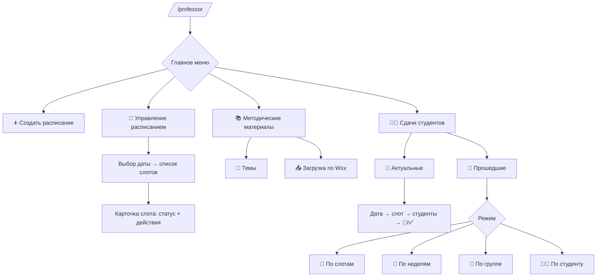

# UX‑маппинг — Преподаватель (`/professor`)

## Принципы
- Единая точка входа: `/professor` (мастер для преподавателя).
- Кнопочная навигация (Inline), минимум ввода текста.
- На каждом экране: **⬅️ Назад**, **🏠 В меню**.
- Цветовые статусы слотов, постраничные списки.

## Главное меню
```
➕ Создать расписание
📅 Управление расписанием
📚 Методические материалы
👨‍🎓 Сдачи студентов
```

## ➕ Создать расписание (мастер)
1) Дата/диапазон → 2) Время начала/конца → 3) Длительность слота → 4) Capacity → 5) Подтверждение → `✅ Создано N слотов`.

## 📅 Управление расписанием
1) Выбор даты → список слотов (с цветами)  
2) Карточка слота:
```
⏰ время | 👥 cap/занято | 📍 место/тип
Статус: 🟢/🟡/🔴/⚪/⚫
[👨‍🎓 Студенты] [✏️ Изменить параметры] [🟢 Открыть/🚫 Закрыть] [❌ Удалить] [⬅️ Назад]
```
### Статусы слотов
- 🟢 **Свободен** — все места свободны  
- 🟡 **Частично свободен** — 0 < занято < capacity  
- 🔴 **Занят** — занято ≥ capacity  
- ⚪ **Закрыт** — запись недоступна  
- ⚫ **Прошёл** — время слота в прошлом

## 📚 Методические материалы
```
📖 Просмотреть список тем курса
📤 Загрузить материалы по неделе
⬅️ Назад
```
- Просмотр: `W01 — Тема …, W02 — …`
- Загрузка: выбрать `Wxx` → загрузить файл → `✅ Материалы для Wxx загружены`.

## 👨‍🎓 Сдачи студентов
```
📆 Актуальные сдачи
📜 Прошедшие сдачи
⬅️ Назад
```

### 📆 Актуальные сдачи
- Дата (сегодня/будущее) → слоты (с цветами) → студенты → действия:
```
📂 Скачать работу
✅ Поставить оценку
⬅️ Назад
```

### 📜 Прошедшие сдачи — режимы поиска
```
🔎 По слотам   (дата → слот → студенты → 📂/✅)
📖 По неделям  (Wxx → [группа?] → студенты → 📂/✅)
👥 По группе   (группа → студент → сдачи → 📂/✅)
🧑‍🎓 По студенту (поиск → студент → сдачи → 📂/✅)
⬅️ Назад
```

## Диаграмма (Mermaid)

